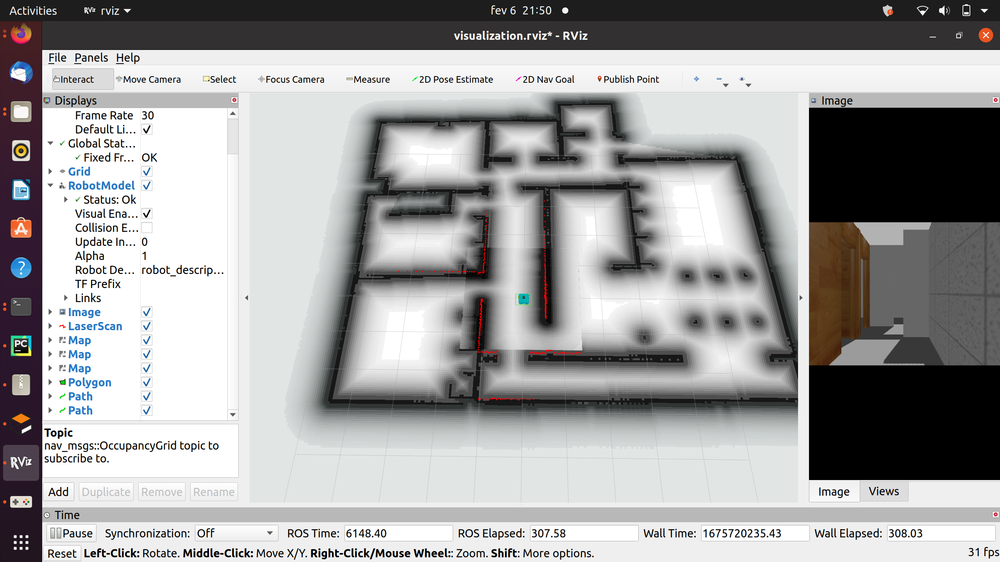

# Trabalho3
Robutler - Robô com perceção de objetos e navegação autónoma  pelo cenário.
Created by: Jorge Silva

# Commands
First open the apartment
```
roslaunch robutler_bringup gazebo.launch 
```
Then bringup the robutler
```
roslaunch robutler_bringup bringup.launch 
```
To load the map preveously recorded:
```
roslaunch robutler_navigation localization.launch
```
To get global and local plan:
```
roslaunch robutler_navigation move_base.launch

```
To make the robot go to different divisions and take photo, run:
```
pathfile/follow_the_route.py
```
To make the robot chase a red ball you have to spawn the red ball
```
pathfile/object_spawner.py
```
Then, launch the file
```
pathfile/follow_red_sphere.py
```
